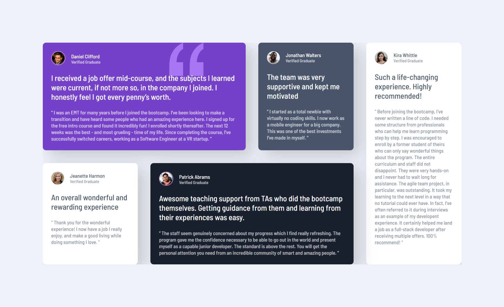

# ISC Docs Landing Page
This is first design draft of ISC Docs website for my final year of college. 

## Welcome! 👋
Thanks for checking out this first frontend design draft for my final year project Website.

Users should be able to:

- View the optimal layout for the page depending on their device's screen size
- See hover states for all interactive elements on the page

### Screenshot

### Built with

- Semantic HTML5 markup
- CSS custom properties
- Flexbox
- CSS Grid
- Mobile-first workflow

### What I learned
Learned somethings about flex properties and other cool stuff about svgs.

### Continued development
Continued development will be added in making this frontend project into a full stack website, which currently I am learning how to.

## Author
- Frontend Mentor - [@suraj-singh127](https://www.frontendmentor.io/profile/suraj-singh127)
